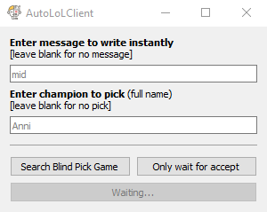

# AutoLoLClient
A tool to automate things in the LoL Client  

### Installation
1. Download [**AutoLoLClient**.zip](https://github.com/DustinScharf/AutoLoLClient/releases/download/v1.2/AutoLoLClient.zip "v1.2")
2. Extract **AutoLoLClient**.zip
3. Run **AutoLoLClient**.exe  

**Download:** https://github.com/DustinScharf/AutoLoLClient/releases/download/v1.2/AutoLoLClient.zip  

Optionally right click **AutoLoLClient**.exe and choose **Send to >** _Desktop (create shortcut)_  

### GUI and functions
  
- **Search blind pick game** _(experimental)_  
Will search a game on its own, type the message and pick the champion  
_Get a drink and come back to a starting game!_

- **Only wait for accept** _(experimental)_  
Will ony wait for accept and then type the message and pick the champion  
_Useful for multiple player lobby or other game modes_

##### Not working?
This project is not up to date, but you can still try the following:
- Start the lol client and login
- Set the lol client language to english
- Set the lol client window size to 1024x576
- Place the lol client window in foreground of your main monitor
